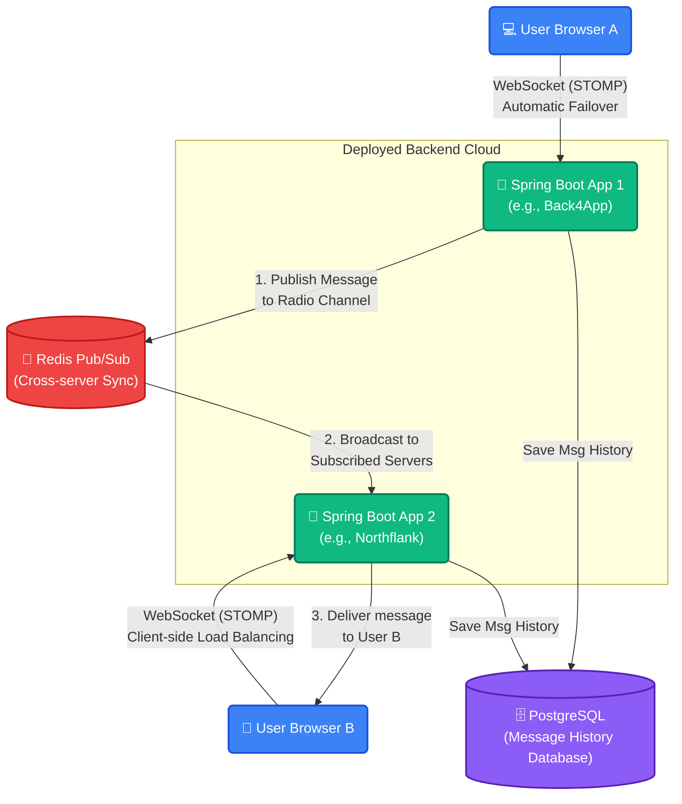

# Real-time Notification Service
Distributed WebSocket system with Redis Pub/Sub

## Architecture
- Spring Boot 3 (WebSocket/STOMP)
- Redis Pub/Sub (Cross-server messaging)
- PostgreSQL (Message persistence)
- Docker Compose (Multi-instance deployment)

1. The "Group" Lane (Broadcast)
Redis Channel: chat
Behavior: When a message hits this lane, it goes to all servers, and then all users.
Use Case: Public messaging, group notifications, or system-wide announcements.
End Result: Every browser tab "hears" this message.
2. The "Individual" Lane (Targeted)
Redis Channel: notifications
Behavior: When a message hits this lane, it still goes to all servers, but each server performs a check: "Is the target user (e.g., Vipin) connected to me?"
End Result: Only one browser tab "hears" this message.

## 🏗️ System Architecture & How It Works

SkyLine's architectural design is built to be highly scalable, completely distributed, and resilient to failures. 

To easily understand how the system works, think of the project like a **Global Delivery Company**:

- **🧑‍💻 The Customers (Web Browsers):** Users sit in their browsers (`index.html`). The browsers have a brain! When users want to chat, the browser checks a list of available **Post Offices** and automatically drives to a random one (Client-Side Load Balancing). If that post office suddenly burns down or shuts its doors, the browser doesn't crash—it immediately drives to the next available Post Office on its list (**Automatic Failover**).
- **🏢 The Local Post Offices (Spring Boot Apps):** Our separate backend deployment instances (like Northflank and Back4App). They have an open door that accepts visitors from literally anywhere in the world (`WebSocket CORS "*"`).
- **🗄️ The Central Archive (PostgreSQL):** Every time someone sends a message at any of the post offices, a carbon copy is mailed down to the deep central archive vault (The Database). When new users join, they can automatically fetch the "History" vault to see what they missed.
- **📻 The Global Radio Tower (Redis Pub/Sub):** Here is the magic. If **User A** drops off a message at the **Northflank Post Office**, how does **User B** at the **Back4App Post Office** get it? Simple! Every time a post office receives a message, it broadcasts it out over a global radio frequency (**Redis Pub/Sub**). Every *other* post office is actively listening to that radio station. When they hear the message over the radio, they grab it and hand-deliver it to their own locally connected customers via WebSockets!

### 📊 Architecture Diagram


###
```Map: payload origin → Redis channel → RedisMessageSubscriber handling → STOMP destination(s) → client subscription

Chat messages (send)
Client STOMP send:
Destination the client sends to: /app/send
Payload: a raw string (message text) — controller receives @Payload String message
CONNECT must include header username so server knows sender
Server controller (NotificationController.handleMessage):
Reads username from session attributes (set by CustomHandshakeInterceptor)
Persists: messageService.saveMessage(sender, message) → returns ChatMessage {sender, message, createdAt, id...}
Converts saved ChatMessage to JSON
Publishes to Redis channel: "chat" (redisTemplate.convertAndSend("chat", jsonMessage))
Redis subscriber (RedisMessageSubscriber.onMessage):
Channel = "chat" → falls into the else branch (not "presence" or "notifications")
Parses JSON into ChatMessage, then:
messagingTemplate.convertAndSend("/topic/messages", chatMessage)
Client(s):
Should subscribe to: /topic/messages
They receive ChatMessage objects (sender, message, createdAt, …)
Summary flow: Client → STOMP SEND /app/send (payload: text) → NotificationController → save → Redis channel "chat" → RedisMessageSubscriber → convertAndSend("/topic/messages", ChatMessage) → Clients subscribed to /topic/messages

Typing indicators (presence)
Client STOMP send:
Destination: /app/typing
Payload: a String status (e.g., "true" / "false" or "start"/"stop") — controller signature is @Payload String status
CONNECT header must include username (so controller can retrieve username)
Server controller (NotificationController.handleTyping):
Reads username from session attributes
Forms a simple string payload: username + ":" + status (e.g., "alice:true")
Publishes to Redis channel: "presence" (redisTemplate.convertAndSend("presence", typingMessage))
Redis subscriber:
Channel == "presence" → messagingTemplate.convertAndSend("/topic/presence", body) (body is "username:status")
Client(s):
Should subscribe to: /topic/presence
They receive raw "username:status" strings (client parses to show "Alice is typing..." or remove indicator)
Summary flow: Client → STOMP SEND /app/typing (payload: "true"/"false") → NotificationController → redis "presence" ("username:status") → RedisMessageSubscriber → convertAndSend("/topic/presence", "username:status") → Clients subscribed to /topic/presence

Server-to-user notifications (simulated API)
External call: GET /api/notify?user={user}&message={message}
NotificationController.notifyUser builds NotificationPayload {user,message} JSON
Publishes to Redis channel: "notifications" (redisTemplate.convertAndSend("notifications", json))
Redis subscriber:
Channel == "notifications" → parse JSON into NotificationData {user, message}
Uses convertAndSendToUser(data.user, "/topic/notifications", data.message)
Because WebSocketConfig setUserDestinationPrefix("/user"), convertAndSendToUser will route to the connected session for that user under the user destination mapping.
Client (specific user):
Should subscribe to: /user/topic/notifications (or subscribe to the user destination shorthand "/user/topic/notifications" in STOMP client)
They receive the message payload directly for that user only
Summary flow: External → HTTP GET /api/notify → redis "notifications" (JSON {user,message}) → RedisMessageSubscriber → convertAndSendToUser(user, "/topic/notifications", message) → Client subscribed to /user/topic/notifications

WebSocket / STOMP connection details (how clients connect & headers)

STOMP endpoint: SockJS endpoint at /ws (registry.addEndpoint("/ws").withSockJS())
Application destination prefix: /app (so client sends to /app/...)
Broker destinations: /topic, /queue (enabled by enableSimpleBroker)
User destination prefix: /user (used by convertAndSendToUser)
Authentication/identification: Client must include header "username" on STOMP CONNECT; CustomHandshakeInterceptor reads it and sets session attribute "username" and the Principal (StompPrincipal) so convertAndSendToUser works.
Concrete STOMP client examples

Send message:
STOMP SEND destination: /app/send
Body: "hello world"
Send typing:
STOMP SEND destination: /app/typing
Body: "true" (or "stop")
Subscribe to show updates:
Subscribe: /topic/messages → receives ChatMessage objects
Subscribe: /topic/presence → receives "username:status" entries for typing
Subscribe: /user/topic/notifications → receives user-specific notifications
```
