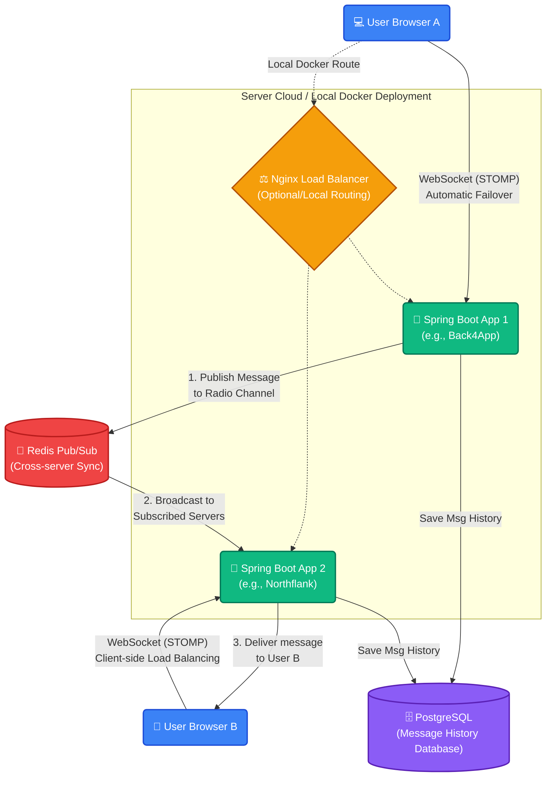

# Real-time Notification Service
Distributed WebSocket system with Redis Pub/Sub

## Architecture
- Spring Boot 3 (WebSocket/STOMP)
- Redis Pub/Sub (Cross-server messaging)
- PostgreSQL (Message persistence)
- Docker Compose (Multi-instance deployment)

1. The "Group" Lane (Broadcast)
Redis Channel: chat
Behavior: When a message hits this lane, it goes to all servers, and then all users.
Use Case: Public messaging, group notifications, or system-wide announcements.
End Result: Every browser tab "hears" this message.
2. The "Individual" Lane (Targeted)
Redis Channel: notifications
Behavior: When a message hits this lane, it still goes to all servers, but each server performs a check: "Is the target user (e.g., Vipin) connected to me?"
End Result: Only one browser tab "hears" this message.

## 🏗️ System Architecture & How It Works

SkyLine's architectural design is built to be highly scalable, completely distributed, and resilient to failures. 

To easily understand how the system works, think of the project like a **Global Delivery Company**:

- **🧑‍💻 The Customers (Web Browsers):** Users sit in their browsers (`index.html`). The browsers have a brain! When users want to chat, the browser checks a list of available **Post Offices** and automatically drives to a random one (Client-Side Load Balancing). If that post office suddenly burns down or shuts its doors, the browser doesn't crash—it immediately drives to the next available Post Office on its list (**Automatic Failover**).
- **🏢 The Local Post Offices (Spring Boot Apps):** Our separate backend deployment instances (like Northflank and Back4App). They have an open door that accepts visitors from literally anywhere in the world (`WebSocket CORS "*"`).
- **🗄️ The Central Archive (PostgreSQL):** Every time someone sends a message at any of the post offices, a carbon copy is mailed down to the deep central archive vault (The Database). When new users join, they can automatically fetch the "History" vault to see what they missed.
- **📻 The Global Radio Tower (Redis Pub/Sub):** Here is the magic. If **User A** drops off a message at the **Northflank Post Office**, how does **User B** at the **Back4App Post Office** get it? Simple! Every time a post office receives a message, it broadcasts it out over a global radio frequency (**Redis Pub/Sub**). Every *other* post office is actively listening to that radio station. When they hear the message over the radio, they grab it and hand-deliver it to their own locally connected customers via WebSockets!

### 📊 Architecture Diagram

